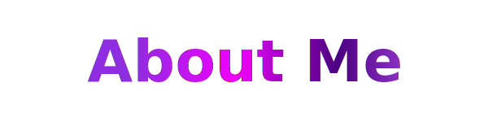
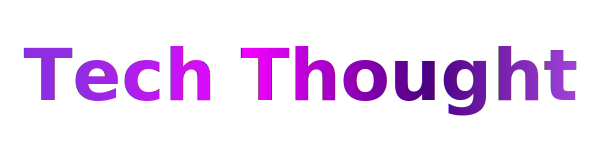

<div align="center">





<h3 align="center">
  👋 Hi, I'm Salman — Passionate about building scalable, smart, and impactful digital solutions 🚀
</h3>

<p align="center">
  💜 Crafting Scalable & Reliable Software for Real-World Impact
</p>

<p align="center">

<a href="#" target="_blank" rel="noopener noreferrer">
  
</a>

<a href="https://www.linkedin.com/in/salman-shah-069805405/" target="_blank" rel="noopener noreferrer">
  
</a>

<a href="mailto:salman.sprogrammer@gmail.com">
  
</a>

</p>


<h3 align="center">

</h3>

```json
{
  "status": 200,
  "message": "Profile fetched successfully",
  "data": {
    "id": "Salman-Programmer",
    "name": "Salman Shah",
    "role": "Full Stack Developer",
    "location": "Pakistan",

    "focus": ["Full Stack Development","DSA","Scalable Architecture"],

    "mindset": "Always Learning • Always Improving • Always Building ",
    "status": "Open to Opportunities"
  }
}
```
<h1>Weapons </h1>

### 👨‍💻 Programming Languages

<p> 
  <a href="#"></a>
  <a href="#"></a>
  <a href="#"></a>
  <a href="#"></a>
</p>

### 🧰 Frameworks and Libraries

<p>  
  <a href="#"></a>
  <a href="#"></a>
  <a href="#"></a>
  <a href="#"></a>
  <a href="#"></a>
  <a href="#"></a>
  <a href="#"></a>
</p>

### 🗄️ Databases & Caching

<p>
    <a href="#"></a>
    <a href="#"></a>
    <a href="#"></a>
</p>

### ☁️ Cloud & DevOps

<p>
    <a href="#"></a>
    <a href="#"></a>
    <a href="#"></a>
    <a href="#"></a>
</p>


## GitHub Streak

<div align="center">
  
</div>

<div align="center">
  
</div>

<h3 align="center">
  
</h3>
<p align="center">
  
</p>


<p align="center">💜 Thanks for visiting — Building the Future with Code 🚀 | ⭐ Star if you like | — <b>Salman Shah</b></p>


